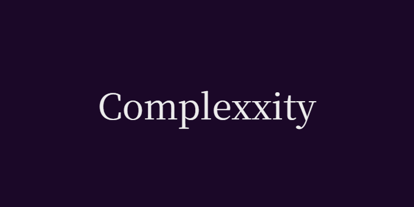

# Complexxity

Wordle, but with algorithms!

## Overview

A new unique puzzle is generated every day, and your goal is to guess which algorithm is selected by interacting with the interface and simulating the algorithm's behaviour. Having a limited number of attempts and a wide variety of algorithms, the game offers a fascinating and unique experience for everyone!

## What makes the project unique?

Unlike basic algorithm visualisers, Complexxity turns algorithms into interactive puzzles. A truly unique experience comes from a combination of an interesting approach that uses interaction with the UI as its core idea and a daily puzzle system where every challenge offers a fresh experience while encouraging players to understand and learn how each of the different algorithms work.

## Why this project was built

This project originally began as a small idea for a school portfolio. However, as the development of the concept continued, I realised it had the potential to become something greater than a simple portfolio project. 

## The goal of the project

The goal is to create a game that makes learning and recognising algorithms both challenging and enjoyable while offering a unique daily puzzle for players of all skill levels.
Whether you're a student learning algorithms, a programmer looking for a daily challenge, or simply someone who enjoys difficult puzzles, Complexxity is designed to make algorithmic thinking engaging and interactive while also keeping it fun and enjoyable.

## Current project stage

The project is in the pre-prototype stage and currently stays in active development. The main focus is on finishing the prototype by adding the key features of the core game logic. 

## Planned features
- Add the record of the player's moves
- Comparison of the player's moves with the algorithm's steps
- Add buttons functionality 
- Add winning after correct guess and losing after given attempts ran out
- Add more interaction with the puzzle (player controls)
- Improve existing visuals, add new visual features